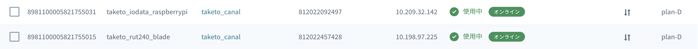

# ROS Melodic Camera App Sample

# Overview

This is an example of sharing images with ros.

- ROS: Melodic

# Prerequisite

You will need followins.

- PC1: It must be connected web camera as /dev/video0.
- PC2: It need ROS visualization softWares such as RQT. It will visualize the published images from the PC1.
- Sim1: This sim is for PC1
- Sim2: This sim is for PC2
- ROUTER1: It needs to port forward for 1025-65535 (ex. RUT240)
- ROUTER2: It needs to port forward for 1025-65535 (ex. RUT240)
- SORACOM VPG + Gate: All the sims needs to belong to the VPG.

# Configuration

## SORACOM

Go to VPG settings and please set up static ips for Sim1 and Sim2.



## Routers

### Firewall

Access from wan needs to be accepted.


### Port Forwarding

All the routers need to enable port forwarding for the port 1025-65535.


## PCs

### Hostname

Check host names of the PCs.

```
hostname
ex) PC1:raspberrypi
ex) PC2:Taketo-Matsunaga-Blade
```

### Configure hosts.

Configure `/etc/hosts` to resolve hostnames among the PCs.

```
Example of /etc/hosts of PC1
127.0.0.1	localhost
127.0.1.1	raspberrypi
10.198.97.225	Taketo-Matsunaga-Blade
```

```
Example of /etc/hosts of PC2
127.0.0.1	localhost
127.0.1.1	Taketo-Matsunaga-Blade
10.209.32.142	raspberrypi
```

### Check reachability

Those connected PCs are in the same network or reachable each other.
You can check with reachability with following commands.

```
Example scat commands of PC1
netcat -l 1234


Example scat commands of PC2
netcat raspberrypi 1234

```

```
Example scat commands of PC1
netcat Taketo-Matsunaga-Blade 1234


Example scat commands of PC2
netcat -l 1234

```

## Build

### PC1

```
docker build -t ros1_devc:1.0 .


docker run --name=ros1_devc -it \
    --volume="$PWD/:/workspace/share:rw" \
    --device=/dev/video0:/dev/video0 \
    --net=host\
    ros1_devc:1.0

```

### PC2

Please install RQT.

## Run

### PC1

```
unset ROS_MASTER_URI
unset ROS_HOSTNAME
unset ROS_IP


export ROS_MASTER_URI=http://raspberrypi:11311
export ROS_HOSTNAME=10.209.32.142

sudo chmod 666 /dev/video0
roslaunch app.launch
```

### PC2

```
unset ROS_MASTER_URI
unset ROS_HOSTNAME
unset ROS_IP


export ROS_MASTER_URI=http://raspberrypi:11311
export ROS_HOSTNAME=10.198.97.225

rqt
```

## Reference


